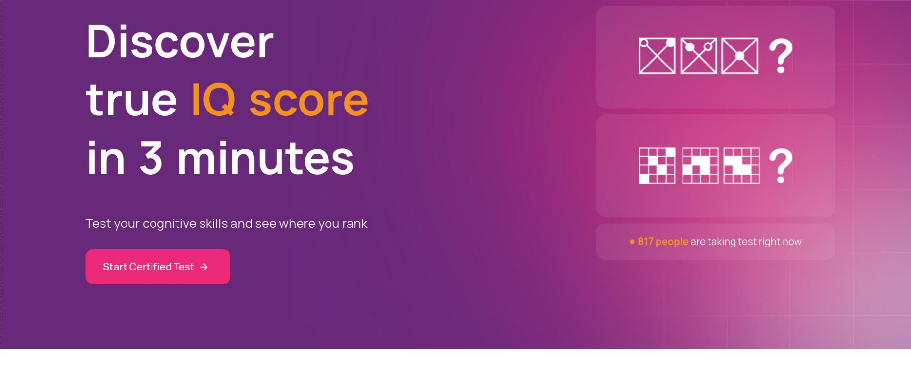
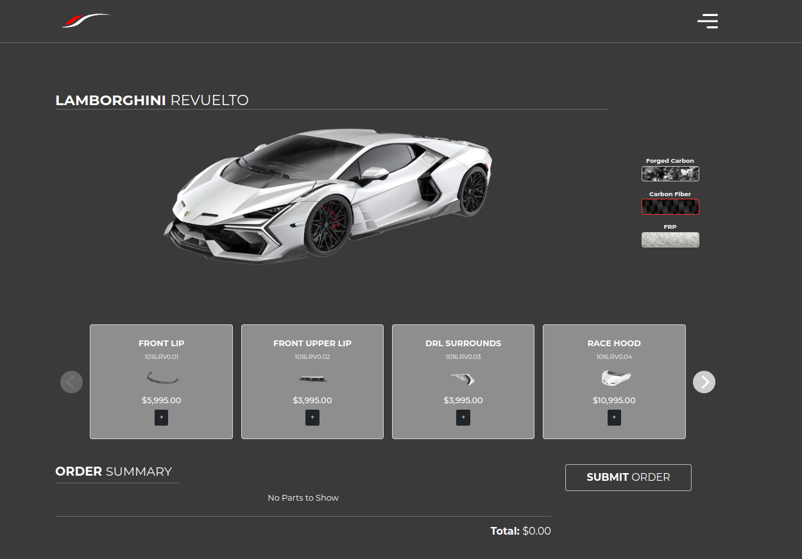

<table>
  <tr>
    <td>
      
    </td>
    <td>
      <h1>Abdullah Ahmad</h1>
      <strong>Lifelong Student | Full Stack Developer | AI Expert</strong>  
        
      🔗 <a href="https://linkedin.com/in/m-abdullah-ahmad/" target="_blank">LinkedIn</a> |  
      💻 <a href="https://github.com/MAbdullahAhmad" target="_blank">GitHub</a> |  
      🎯 <a href="https://www.upwork.com/freelancers/~0137b2c08245bbaef9" target="_blank">Upwork</a> |  
      ▶️ <a href="https://www.youtube.com/@theneweratech5177" target="_blank">YouTube</a>  
    </td>
  </tr>
</table>

---

## Professional Summary  
I am a **full-stack web developer** with over **5 years of experience** in **Laravel**. Beyond web development, I have a strong passion for **AI**, **algorithm design**, and **programming competitions**. I am dedicated to creating high-quality products and continuously learning new skills to stay ahead in the ever-evolving tech landscape.

---

## Education  
**University of Management and Technology**  
*Bachelors in Artificial Intelligence*  
*May 2021 - Present*  
Lahore, Pakistan  

---

## Experience  

### **UpWork**  
*Laravel Developer*  
*Jun 2021 - Present*  
Miami, USA  
- Developed and maintained **7 long-term projects**.  
- Worked on **several short-term projects**.  
- Collaborated on **2 part-time remote job contracts**.  

### **Microtech**  
*Web Developer*  
*Jan 2021 - Jul 2021*  
Bahawalpur, Pakistan  
- Provided **Django training** to two batches.  
- Developed **3 local projects** using **Laravel** and **PHP**.  

### **CodeLab**  
*Jr. Web Developer*  
*Jun 2020 - Dec 2020*  
Bahawalpur, Pakistan  
- Collaborated as a **Backend Developer** in a team.  
- Worked on **3 PHP projects**.  

---

## Projects  

### **IQMetric (Online IQ Test)**  
*Laravel, MySQL, CRON-Jobs, Custom CSS, Payment Integration*  
- Added **certificate generation**, **IQ history graphs**, **reports**, and **IQ games**.  
- Developed a **CMS** for test management and administration.  
- Created **custom email templates** for campaigns, alerts, and notifications.  
- Integrated **3 payment methods** for seamless transactions.  

### **Razaenvironmental Portal (Content Management System)**  
*PHP, Leads Management, Cloud Storage*  
- Developed an **Access Control Portal** for managing clients.  
- Created a **tickets-booking** and **task-assignment portal**.  
- Integrated **in-app client support** through ticket chat.  
- Built **4 sub-apps** for document processing automation.  

### **1016industries Visualizer (Interactive Visualization System)**  
*Laravel, PHP, MySQL, SVG, ThreeJS*  
- Built an app to **hover over parts** and visualize **40+ cars** in 2D and 3D.  
- Added **email-based lead generation** for user engagement.  

### **CWMG CRM (Customer Relationship Management)**  
*Laravel, PHP, Postgres, Web Automation*  
- Developed a **leads management system** for truck dispatching.  
- Integrated **prepaid, postpaid, and commission-based payments**.  
- Added **web scraping** and **automation** features.  

---

---

## Accomplishments  
- Collaborated in a **team of 7** at **CodeLab**.  
- Conducted **client calls** for requirements gathering and demo presentations.  
- Trained **3 resources** in **Web Development**.  

---

## Recent Contributions

## Skills I Work In

  
  
  
  
  
  
  
  
  
  
  
  
  
  
  
  
  

  
  
  
  
  
  
  

  &nbsp;
  

  
  
  
  
  
  
  

  &nbsp;
  

  
  
  
  
  
  
  

  &nbsp;
  

  
  
  
  
  
  
  

  
  
  
  
  
  
  
  
  
  
  
  
  

  
  
  

  
  
  
  
  
  
  

  
  
  
  
  

  

  
  
  

___

## Let’s Connect!  
I’m always open to new opportunities, collaborations, and discussions. Feel free to reach out to me via Email [alif.abdullah.ahmad@gmail.com](mailto:alif.abdullah.ahmad@gmail.com) or Phone [+92 310 4090514](tel:+923104090514). Let’s build something amazing together!

---

**Thank you for visiting my portfolio!**  
Looking forward to connecting with you. 😊

About Me

## Blog

Feel free to take a look aat my blog post onleft side